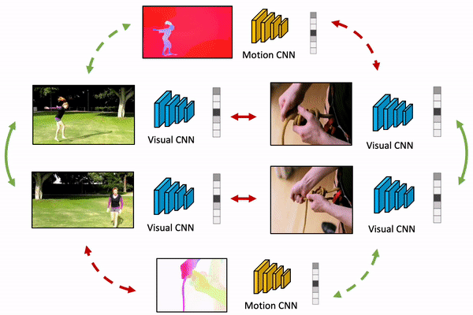

# MaCLR

> [**MaCLR: Motion-aware Contrastive Learning of Representations for Videos**](https://arxiv.org/abs/2106.09703),            
> Fanyi Xiao, Joseph Tighe, Davide Modolo   





    @inproceedings{xiao2022maclr,
      title={SMaCLR: Motion-aware Contrastive Learning of Representations for Videos},
      author={Xiao, Fanyi and Tighe, Joseph and Modolo, Davide},
      booktitle={ECCV},
      year={2022}
    }
    
    
## Abstract
We present MaCLR as a novel method to explicitly perform cross-modal self-supervised video representations learning from visual and motion modalities.Compared to previous video representation learning methods that mostly focus on learning motion cues implicitly from RGB inputs, MaCLR enriches standard contrastive learning objectives for RGB video clips with a cross-modal learning objective between a Motion pathway and a Visual pathway. We show that the representation learned with our MaCLR method focuses more on foreground motion regions and thus generalizes better to downstream tasks. To demonstrate this, we evaluate MaCLR on five datasets for both action recognition and action detection, and demonstrate state-of-the-art self-supervised performance on all datasets. 
Furthermore, we show that MaCLR representation can be as effective as representations learned with full supervision on UCF101 and HMDB51 action recognition, while even outperforming the supervised representation for action recognition on VidSitu and SSv2, and action detection on AVA.  


Note: Due to legal reasons, we can only release the pretrained model and the finetuning code. 

## Installation

- Create the python environment: `virtualenv -p python3 maclr` and activate the environment with `source /PATH/TO/ENV/maclr/bin/activate`
- Install all dependencies: 
```
pip install torch==1.7.0+cu101 torchvision==0.8.1+cu101 torchaudio==0.7.0 -f https://download.pytorch.org/whl/torch_stable.html 
pip install fvcore simplejson av psutil opencv-python tensorboard moviepy indexed kornia==0.5.7 matplotlib librosa einops timm
```
- Navigate to code directory and install the repo with `python setup.py develop`


## Data preparation

You need to download UCF101 datasets from their respective sites and format the structure like the following:
```
maclr
├── data
│	├── pretrained
│	│	└── maclr.pyth
│	└── ucf101
│		├── data
│		└── simple_annot
│			├── split1
│			│   ├── train.csv
│			│   └── val.csv
│			├── split2
│			│   ├── train.csv
│			│   └── val.csv
│			└── split3
│			    ├── train.csv
│			    └── val.csv
└── src
    ├── configs
    │   └── UCF101
    ├── slowfast
    │   ├── config
    │   ├── datasets
    │   ├── models
    │   ├── utils
    │   └── visualization
    └── tools
```
where `.csv` file are with rows as `video_path class_idx`. 


## Model 

You can download a pre-trained SLOW_32x8_R50 MaCLR model here: [MaCLR model](https://aws-cv-sci-motion-public.s3.us-west-2.amazonaws.com/MaCLR/model_zoos/maclr.pyth)


## Transfer pretrained MaCLR model to UCF101 

End-to-end finetuning:
```
python run_net.py \
--cfg ../configs/UCF101/SLOW_32x8_R50.yaml \
--output_dir ../../data/output/UCF101/SLOW_32x8_R50_Pretrain_MaCLR 
```

Linear-probing:
```
python run_net.py \
--cfg ../configs/UCF101/SLOW_32x8_R50_CLSONLY.yaml \
--output_dir ../../data/output/UCF101/SLOW_32x8_R50_CLSONLY_Pretrain_MaCLR
```

## Licence
We release this repository under Apache License 2.0. This repository enables users to download a pre-trained MaCLR representation and fine-tune it on downstream tasks, like action recognition on UCF101. This repository does not include training code for MaCLR, as that is currently patent pending. 
